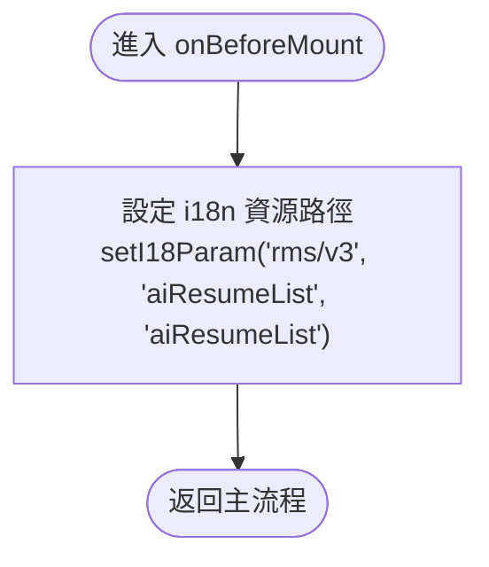
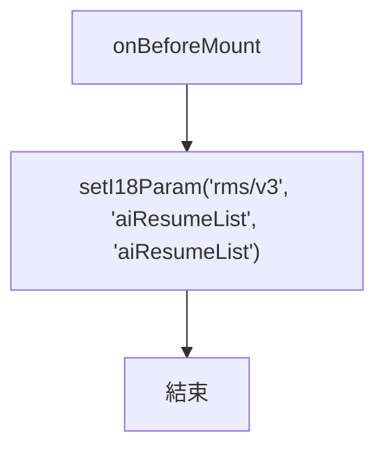

# 繪製 Flowchart 基本原則

## 子流程拆分

- 以「語意上是否為獨立階段」作為拆分依據
- 當一個步驟屬於語意上的獨立階段時，使用子流程節點（`[["..."]]`）表示，細節放在獨立的 flowchart 呈現

## 一致性

- 同一份 flowchart 中，同層級、同類型的項目，以相同方式處理
  - 例如：主流程中有多個 lifecycle hook，應全部拆為子流程節點，保持一致

## 子流程 Flowchart 格式

- 進入點使用 `(["進入 ..."])` 
- 結束點使用 `(["返回主流程"])`

### Good Example

### Bad Example

## 節點描述

- 每個節點以語意化描述為主，讓讀者理解「這一步在做什麼事」
