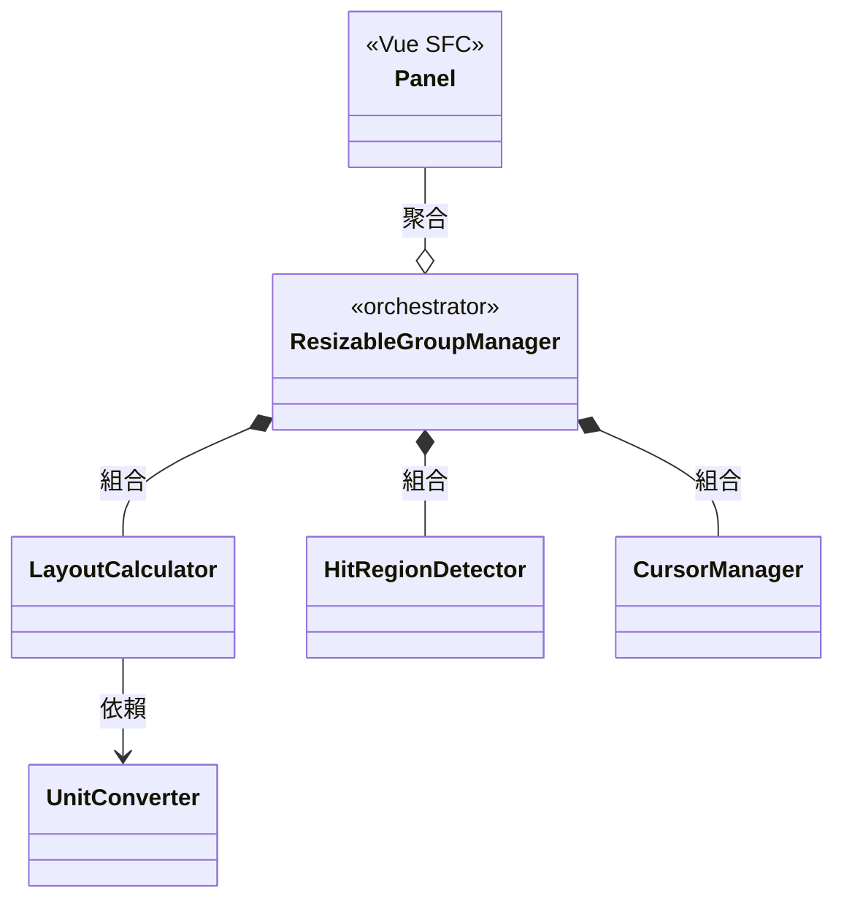

# vue-resizable-panel

Vue 2 的可拖曳調整大小面板元件庫。核心邏輯以純 JavaScript class 實作，不依賴 Vue API，元件層為薄膠水層。

## Features

- 拖曳調整相鄰 Panel 大小
- 支援 `%` 與 `px` 混合單位設定 `defaultSize`、`minSize`、`maxSize`
- 容器 resize 自動重算 layout（ResizeObserver）
- 約束衝突自動處理（maxSize 優先）
- 拖曳期間自動管理 cursor 樣式與文字選取
- Panel 動態註冊 / 移除

## Installation

```bash
npm install vue-resizable-panel
```

## Quick Start

```vue
<template>
  <div ref="panelGroup" class="panel-group">
    <Panel ref="panelA" panelId="a" :size="panelLayout.a">
      <div>Panel A ({{ panelLayout.a.toFixed(1) }}%)</div>
    </Panel>
    <Panel ref="panelB" panelId="b" :size="panelLayout.b">
      <div>Panel B ({{ panelLayout.b.toFixed(1) }}%)</div>
    </Panel>
  </div>
</template>

<script>
import { ResizableGroupManager } from 'vue-resizable-panel/src/core/ResizableGroupManager.js'
import Panel from 'vue-resizable-panel/src/components/Panel.vue'

export default {
  components: { Panel },

  data() {
    return {
      panelLayout: { a: 0, b: 0 }
    }
  },

  created() {
    this._manager = null
  },

  mounted() {
    this._manager = new ResizableGroupManager({
      groupConfig: {
        element: this.$refs.panelGroup,
        disabled: false,
        disableCursor: false
      },
      panelConfigs: [
        { id: 'a', element: this.$refs.panelA.$el, defaultSize: '70%', minSize: '20%' },
        { id: 'b', element: this.$refs.panelB.$el, defaultSize: '30%', minSize: '20%' }
      ]
    })

    this._manager.on(this._manager.Event.LayoutChange, (layoutResult) => {
      const layout = {}
      for (const [id, { size }] of Object.entries(layoutResult)) {
        layout[id] = size
      }
      this.panelLayout = layout
    })

    this._manager.activate()
  },

  beforeDestroy() {
    if (this._manager) {
      this._manager.deactivate()
    }
  }
}
</script>

<style>
.panel-group {
  display: flex;
  height: 300px;
  overflow: hidden;
}
</style>
```

### CSS 要求

Group 容器需設定 `display: flex`。Panel 透過 `flex-basis: 0` + `flex-grow` 分配空間，容器的 `flex-direction` 決定排列方向。

## Architecture Overview



### Modules

| Module | Description | Docs |
|--------|-------------|------|
| [ResizableGroupManager](docs/ResizableGroupManager.md) | Orchestrator，協調各模組，管理 panel 註冊、拖曳流程、容器 resize，對外提供事件通知 API | [details](docs/ResizableGroupManager.md) |
| [LayoutCalculator](docs/LayoutCalculator.md) | Layout 數學引擎 — 初始分配、delta 調整、約束驗證、浮點容差比較 | [details](docs/LayoutCalculator.md) |
| [UnitConverter](docs/UnitConverter.md) | 單位解析（`%`、`px`）與轉換 | [details](docs/UnitConverter.md) |
| [HitRegionDetector](docs/HitRegionDetector.md) | 命中區域判定 — 座標比對偵測指標是否在 Panel 邊界，支援粗/細指標 | [details](docs/HitRegionDetector.md) |
| [CursorManager](docs/CursorManager.md) | 拖曳期間全域樣式管理 — cursor 與 user-select，作用於 document.body | [details](docs/CursorManager.md) |

## Core Flows

### activate()

1. 計算容器可用空間（`_getAvailableSize`）
2. 將所有 panel 的 `minSize` / `maxSize` 從原始單位轉為百分比（`_computeAllConstraints`）
3. 根據 `defaultSize` 計算初始 layout，超出 100% 則等比例 normalize（`calculateInitialLayout`）
4. 套用 min/max 約束，溢出部分從 index 0 開始重分配（`_applyConstraints`）
5. 綁定 pointer 事件與 ResizeObserver
6. 觸發 `LayoutChange` 事件，回傳 `LayoutResult`

### Drag（拖曳三階段）

**pointerdown**
1. 命中偵測（`HitRegionDetector.detect`）判斷指標是否在 Panel 邊界
2. 命中且左右 Panel 皆未 disabled → 建立 DragState，記錄 `initialLayout` 與 `pointerDownAt`
3. 設定拖曳 cursor（`CursorManager.setDrag`）

**pointermove**
1. 計算 pixel delta（當前座標 - pointerDownAt），轉為百分比
2. 以 `initialLayout`（非累計）為基底，呼叫 `adjustLayoutByDelta` 計算新 layout
3. 左右 Panel 各自 clamp 到 min/max，取較小 delta 一側（全有或全無）
4. layout 有變化時觸發 `LayoutChange`，cursor 反映約束方向

**pointerup**
1. 重置 DragState 與 cursor
2. 觸發 `LayoutChanged`（final）事件

### Container Resize（ResizeObserver）

1. 容器寬度變化時觸發
2. 以新寬度重算所有 panel 的 px → % 約束（`_computeAllConstraints`）
3. 以既有 layout 呼叫 `validateLayout` 驗證是否仍合法
4. 約束收緊導致違規時，自動 clamp + 重分配
5. layout 有變化時觸發 `LayoutChange`

> 完整數值走讀範例請參考 [flowSpec.md](docs/flows/flowSpec.md)（以 Group 1 配置帶入具體數值追蹤三階段計算流程）。
