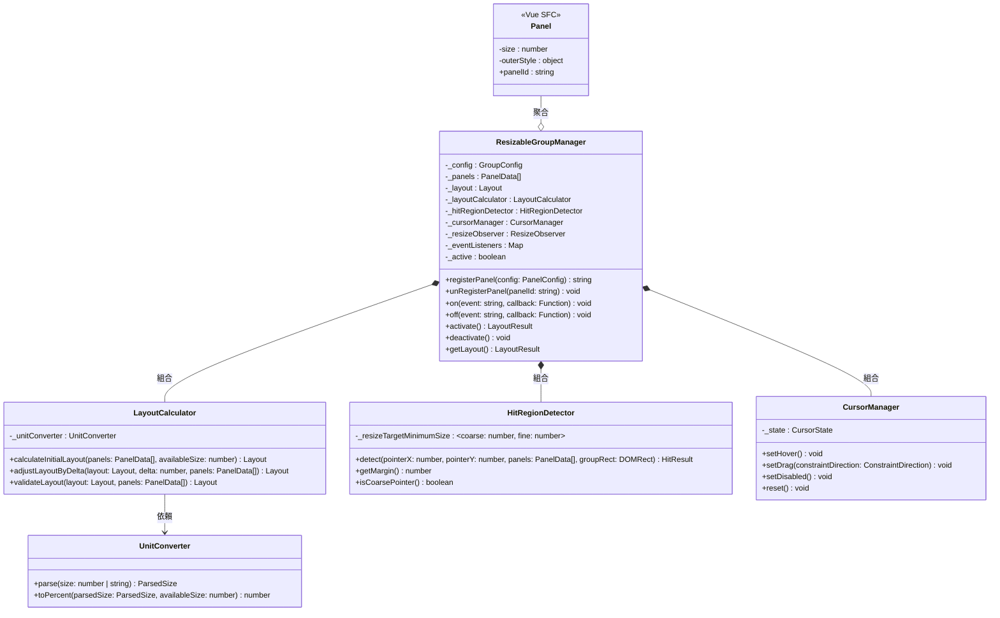
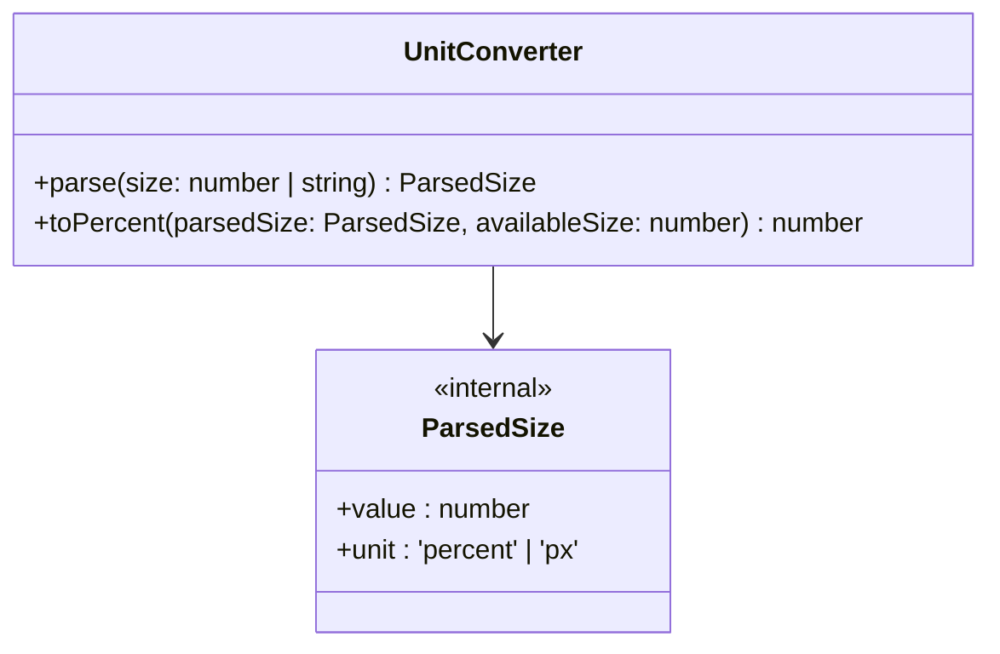
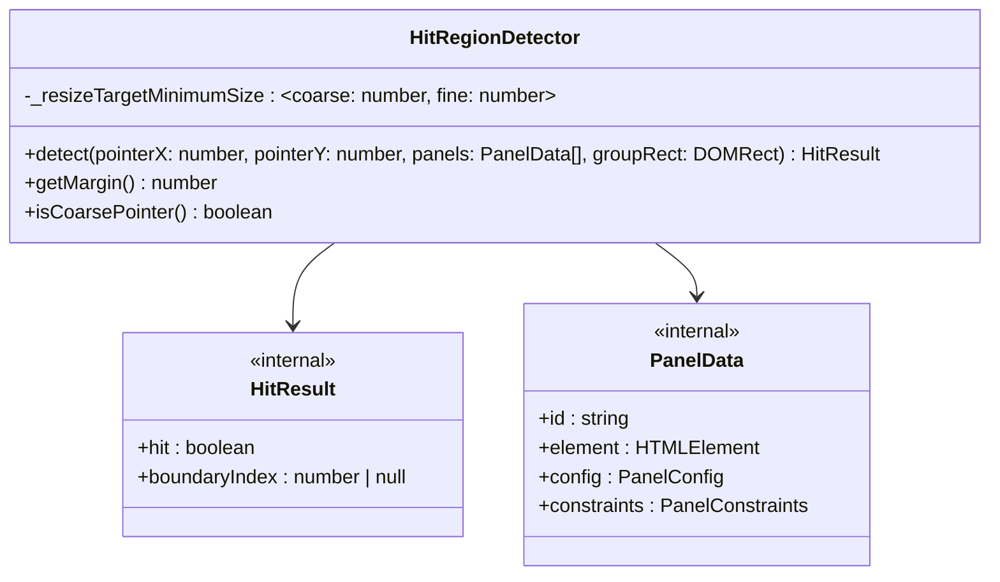
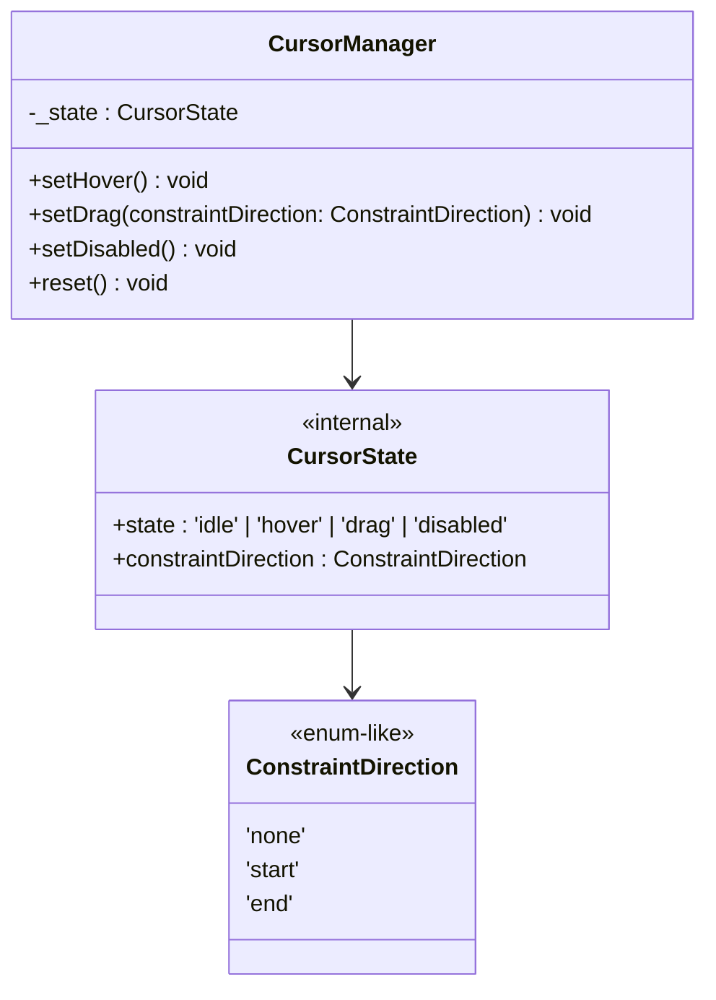

# v1 系統分析 / 架構設計

> 版本：v1 — 2 Panel + 基礎拖曳
> 建立日期：2026-05-14
> 對應規格：`V1-SPEC.md`

---

## 架構決策

- 核心邏輯以純 JS class 實作，不依賴 Vue API
- 模組以 OOP 開發，遵守 SOLID 原則
- 各模組職責獨立，Manager 作為 orchestrator 協調各模組
- 元件層（Vue SFC）為薄膠水層，透過 callback 機制接收 Manager 的狀態變化
- 使用者直接操作 Manager，未來再用 Facade 包一層元件（PanelGroup）

---

## Class Diagram



### ResizableGroupManager

```mermaid
classDiagram
    direction TB

    class ResizableGroupManager {
        -_config : GroupConfig
        -_panels : PanelData[]
        -_layout : Layout
        -_layoutCalculator : LayoutCalculator
        -_hitRegionDetector : HitRegionDetector
        -_cursorManager : CursorManager
        -_resizeObserver : ResizeObserver
        -_eventListeners : Map
        -_active : boolean
        +registerPanel(config: PanelConfig) string
        +unRegisterPanel(panelId: string) void
        +on(event: string, callback: Function) void
        +off(event: string, callback: Function) void
        +activate() LayoutResult
        +deactivate() void
        +getLayout() LayoutResult
    }

    class GroupConfig {
        <<input>>
        +element : HTMLElement
        +disabled : boolean
        +disableCursor : boolean
        +resizeTargetMinimumSize : ~coarse: number, fine: number~
    }

    class PanelConfig {
        <<input>>
        +id : string
        +element : HTMLElement
        +defaultSize : number | string
        +minSize : number | string
        +maxSize : number | string
        +disabled : boolean
    }

    class PanelData {
        <<internal>>
        +id : string
        +element : HTMLElement
        +config : PanelConfig
        +constraints : PanelConstraints
    }

    class PanelConstraints {
        <<internal>>
        +minSize : number
        +maxSize : number
    }

    class Layout {
        <<internal / plain object>>
        +[panelId] : number
    }

    class LayoutResult {
        <<callback payload / plain object>>
        +[panelId] : ~size: number, element: HTMLElement~
    }

    ResizableGroupManager --> GroupConfig
    ResizableGroupManager --> PanelData
    ResizableGroupManager --> Layout
    ResizableGroupManager --> LayoutResult
    PanelData --> PanelConfig
    PanelData --> PanelConstraints
```



### UnitConverter



### HitRegionDetector



### CursorManager



---

## 資料結構

### 輸入面（使用者傳入）

#### GroupConfig

Manager 建構時傳入。

| 欄位 | 型別 | 預設值 | 說明 |
|------|------|--------|------|
| element | `HTMLElement` | — | Group 容器的 DOM 參照（必填），ResizeObserver 的監聽目標 |
| disabled | `boolean` | `false` | 停用整組 resize |
| disableCursor | `boolean` | `false` | 關閉游標管理 |
| resizeTargetMinimumSize | `{ coarse: number, fine: number }` | `{ coarse: 20, fine: 10 }` | 命中區域大小（px） |

#### PanelConfig

`registerPanel()` 時傳入。

| 欄位 | 型別 | 預設值 | 說明 |
|------|------|--------|------|
| id | `string` | — | panel 唯一識別（必填） |
| element | `HTMLElement` | — | panel 外層 div 的 DOM 參照（必填），由使用者自行傳入 |
| defaultSize | `number \| string` | `undefined` | 初始尺寸，`50` / `"50%"` / `"200px"` |
| minSize | `number \| string` | `"0%"` | 最小尺寸 |
| maxSize | `number \| string` | `"100%"` | 最大尺寸 |
| disabled | `boolean` | `false` | 停用此 panel 的 resize |

### 內部面（模組之間傳遞）

#### ParsedSize

UnitConverter 解析結果。

| 欄位 | 型別 | 說明 |
|------|------|------|
| value | `number` | 數值 |
| unit | `'percent' \| 'px'` | 單位類型 |

#### PanelConstraints

衍生的百分比約束，容器 resize 時從原始 config 重算。

| 欄位 | 型別 | 說明 |
|------|------|------|
| minSize | `number` | 百分比（0-100） |
| maxSize | `number` | 百分比（0-100） |

#### PanelData

Manager 內部管理的 panel 完整資料。

| 欄位 | 型別 | 說明 |
|------|------|------|
| id | `string` | panel 識別 |
| element | `HTMLElement` | DOM 參照 |
| config | `PanelConfig` | 原始配置（保留原始值，px 重算時需要） |
| constraints | `PanelConstraints` | 衍生百分比約束 |

#### Layout

```js
{ [panelId: string]: number }
```

值為百分比（0-100），所有值加總 = 100。使用 plain object。Panel 順序由 Manager 內部的 `_panels` 陣列維護（基於 DOM 位置排序），Layout 本身不保證順序。

#### HitResult

HitRegionDetector 的判定結果。

| 欄位 | 型別 | 說明 |
|------|------|------|
| hit | `boolean` | 是否命中邊界區域 |
| boundaryIndex | `number \| null` | 命中的邊界索引，未命中時為 `null`。v1 只有 0 或 null（兩個 panel 只有一條邊界） |

#### ConstraintDirection

拖曳時的約束方向，CursorManager 用來決定顯示哪種 cursor。

| 值 | 說明 |
|------|------|
| `'none'` | 兩側都可移動 |
| `'start'` | 起始側碰到約束（水平 = 左側碰到 min/max） |
| `'end'` | 結束側碰到約束（水平 = 右側碰到 min/max） |

#### CursorState

CursorManager 的內部狀態。

| 欄位 | 型別 | 說明 |
|------|------|------|
| state | `'idle' \| 'hover' \| 'drag' \| 'disabled'` | 當前互動狀態 |
| constraintDirection | `ConstraintDirection` | 拖曳時的約束方向，非 drag 狀態時為 `'none'` |

Cursor 映射：

| state | constraintDirection | cursor |
|-------|-------------------|--------|
| idle | — | 不設定 |
| hover | — | `col-resize` |
| drag | none | `col-resize` |
| drag | start | `e-resize` |
| drag | end | `w-resize` |
| disabled | — | `not-allowed` |

#### LayoutResult

Callback 傳出用的 enriched payload，與內部 Layout（純百分比）區分。

```js
{
  [panelId: string]: {
    size: number,        // 百分比（0-100）
    element: HTMLElement  // panel 的 DOM 參照
  }
}
```

### 事件型別

透過 `on(event, callback)` / `off(event, callback)` 註冊與取消。

| 事件名稱 | Callback 簽章 | 觸發時機 |
|----------|------|---------|
| `Event.LayoutChange` | `(layoutResult: LayoutResult) => void` | 拖曳中每幀 |
| `Event.LayoutChanged` | `(layoutResult: LayoutResult) => void` | 拖曳結束 |

### Public API

| 方法 | 回傳值 | 說明 |
|------|--------|------|
| `constructor(options)` | — | 建立 Manager，接收 `{ groupConfig: GroupConfig, panelConfigs?: PanelConfig[] }` |
| `registerPanel(config: PanelConfig)` | `string` | 註冊 panel，回傳 panelId。只做註冊，不觸發重算 |
| `unRegisterPanel(panelId: string)` | `void` | 反註冊 panel |
| `on(event: string, callback: Function)` | `void` | 註冊事件監聽 |
| `off(event: string, callback: Function)` | `void` | 取消事件監聽，需傳入原始 callback 參照 |
| `activate()` | `LayoutResult` | 計算初始 layout、啟動 ResizeObserver 與 pointer 事件監聽、回傳初始 LayoutResult |
| `deactivate()` | `void` | 停止計算、停止 ResizeObserver、移除 pointer 事件監聽。已註冊的 panels 保留 |
| `getLayout()` | `LayoutResult` | 取得當前 layout |

---

## 使用範例

### 場景 1：純 JS/HTML，DOM 已存在，SidePanel 預設展開

```js
const manager = new ResizableGroupManager({
  groupConfig: {
    element: document.getElementById('group'),
    disabled: false,
    disableCursor: false
  },
  panelConfigs: [
    { id: 'main', element: document.getElementById('main'), defaultSize: '70%', minSize: '30%' },
    { id: 'side', element: document.getElementById('side'), defaultSize: '30%', minSize: '200px' }
  ]
})

manager.on(manager.Event.LayoutChange, function (layoutResult) { /* 每幀更新 */ })
manager.on(manager.Event.LayoutChanged, function (layoutResult) { /* 拖曳結束 */ })

const layoutResult = manager.activate()
```

### 場景 2：Vue CSR，SidePanel 按鈕觸發展開

```js
// 頁面載入時，先建立 manager（此時 SidePanel 尚未渲染）
const manager = new ResizableGroupManager({
  groupConfig: {
    element: document.getElementById('group'), // Group 容器已存在
    resizeTargetMinimumSize: { coarse: 20, fine: 10 }
  }
})

manager.on(manager.Event.LayoutChange, function (layoutResult) { /* ... */ })

// Vue 元件 methods
methods: {
  openSidePanel() {
    this.showSidePanel = true

    this.$nextTick(() => {
      // DOM 渲染完成後，註冊 panel 並啟動
      manager.registerPanel({ id: 'main', element: this.$refs.main.$el, defaultSize: '70%' })
      manager.registerPanel({ id: 'side', element: this.$refs.side.$el, defaultSize: '30%', minSize: '200px' })
      const layoutResult = manager.activate()
    })
  },

  closeSidePanel() {
    manager.deactivate()
    this.showSidePanel = false
  },

  reopenSidePanel() {
    this.showSidePanel = true
    this.$nextTick(() => {
      // 已註冊的 panels 保留，重新啟動時重算約束
      const layoutResult = manager.activate()
    })
  }
}
```

### 場景 3：動態新增 Panel（v2 展望）

```js
// registerPanel 只做註冊，不觸發重算（遵守 SRP）
manager.registerPanel({ id: 'detail', element: detailEl, defaultSize: '25%' })

// 重算需手動觸發，或未來 Facade 提供便利 API
const layoutResult = manager.activate()
```

### 取消事件監聽

```js
function handleLayoutChange(layoutResult) { /* ... */ }

manager.on(manager.Event.LayoutChange, handleLayoutChange)

// 之後不需要時，傳入原始 callback 參照
manager.off(manager.Event.LayoutChange, handleLayoutChange)
```

---

## 設計決策記錄

### Panel 不持有約束配置

defaultSize / minSize / maxSize 等約束值在 Manager 層面配置（透過 `registerPanel` 的 PanelConfig），不作為 Panel 組件的 props。Panel 是純粹的渲染層，只接收 Manager 算好的百分比並設定 CSS（flexGrow）。

### Panel 順序基於 DOM 位置

Manager 透過 `element.offsetLeft`（水平）/ `element.offsetTop`（垂直）排序已註冊的 panel，與 react-resizable-panels 的做法一致。不依賴註冊順序或顯式 index。

### registerPanel 回傳 panelId + unRegisterPanel API

registerPanel 回傳 panelId（string），Manager 提供 `unRegisterPanel(panelId)` public API 讓使用者反註冊。不使用回傳 unregister function 的模式。

### registerPanel 職責單一

registerPanel 只做「註冊」，不觸發 layout 重算（遵守 SRP）。重算由 `activate()` 負責，或未來 Facade 提供「register + recalculate」的便利 API。

### 內部 Layout 與 Callback LayoutResult 分離

- 內部計算用 `Layout`（`{[panelId]: number}`）— 純百分比，給 LayoutCalculator 用
- Callback 傳出用 `LayoutResult`（`{[panelId]: { size, element }}`）— Manager 包裝後傳給外部消費者，自足不需額外查找

### activate / deactivate 生命週期

- `activate()` — 計算初始 layout、啟動 ResizeObserver 與 pointer 事件監聽、回傳 LayoutResult
- `deactivate()` — 停止計算與監聽，已註冊的 panels 保留
- 可重複呼叫 activate / deactivate 循環（如 SidePanel 展開/收合）
- deactivate 期間容器大小若改變，activate 時會重算約束（px → % 轉換）

### 事件機制使用 on / off

- `on(event, callback)` 註冊事件，回傳 void
- `off(event, callback)` 取消事件，需傳入原始 callback 參照
- 事件註冊在 activate / deactivate 循環中保留，不需重新註冊

### Group 容器元素顯式傳入

GroupConfig 必填 `element`，作為 ResizeObserver 的監聯目標。availableSize 從 Panel 元素的 offsetWidth 加總計算（排除非 Panel 元素佔的空間），與 react-resizable-panels 策略一致。

### Constructor 支援可選 panelConfigs

Constructor 接收 `{ groupConfig, panelConfigs? }`。panelConfigs 適用於 DOM 已存在的場景（純 JS/HTML、SSR 後）。Vue CSR 等 DOM 未就緒的場景，panel 透過後續 `registerPanel()` 註冊。

### Panel 更新機制延後決策

計算寬度和整體架構完成後，再決定如何更新 Panel 的 CSS（flexGrow）。目前只確認 callback payload 的結構（LayoutResult），具體的 Panel 更新方式留到下一階段。

### 原始值與衍生值分離

PanelData 同時保留原始 config（PanelConfig，含使用者傳入的 `"200px"` 等原始值）和衍生約束（PanelConstraints，全部為百分比）。容器 resize 時，從原始值重新計算衍生約束。

---

## 模組職責

| 模組 | 層級 | 職責 |
|------|------|------|
| ResizableGroupManager | 純 JS | orchestrator — 協調 layout 計算、拖曳事件、命中偵測、游標管理、ResizeObserver；對外提供 callback 註冊與 panel 管理 API |
| LayoutCalculator | 純 JS | layout 數學 — 初始分配、delta 調整、雙向 clamp、100% 不變式驗證 |
| UnitConverter | 純 JS | 單位解析（%、px）與轉換為百分比 |
| HitRegionDetector | 純 JS | 判斷指標是否在拖曳命中區域內、偵測粗/細指標類型 |
| CursorManager | 純 JS | 管理 cursor 狀態切換（hover / drag / directional / disabled / reset） |
| Panel | Vue SFC | 薄元件 — 向 Manager 註冊、透過 callback 接收 layout 變化、computed 產生 style |

---

## 狀態通知機制

```
Manager 內部狀態變化（拖曳 / ResizeObserver）
  → 計算新 layout
  → 呼叫已註冊的 callback
    → Panel 的 callback 更新 data 內的 size
      → Vue 偵測到 data 變化 → 重新渲染
```

---

## 依賴方向

```
Panel → ResizableGroupManager → LayoutCalculator → UnitConverter
                              → HitRegionDetector
                              → CursorManager
```

所有依賴單向向下，無循環依賴。
