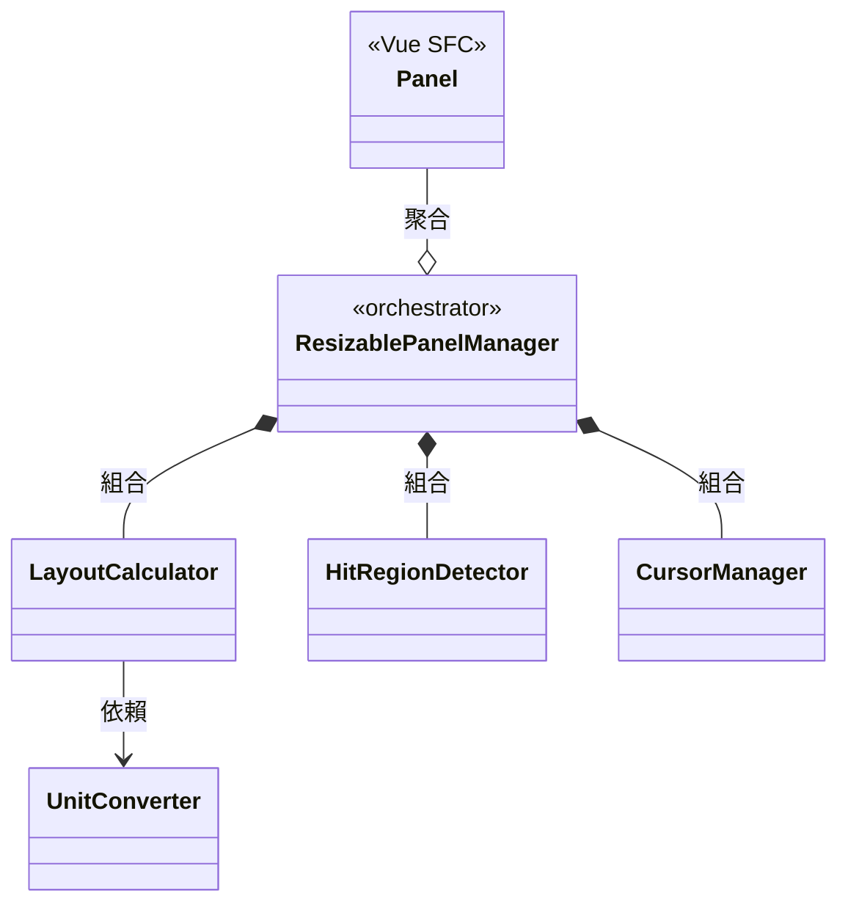

# Architecture Overview

## Modules

| Module | Description | Docs |
|--------|-------------|------|
| [ResizablePanelManager](ResizablePanelManager.md) | Orchestrator，協調各模組，管理 panel 註冊、拖曳流程、容器 resize，對外提供事件通知 API | [details](ResizablePanelManager.md) |
| [LayoutCalculator](LayoutCalculator.md) | Layout 數學引擎 — 初始分配、delta 調整、約束驗證、浮點容差比較 | [details](LayoutCalculator.md) |
| [UnitConverter](UnitConverter.md) | 單位解析（`%`、`px`）與轉換 | [details](UnitConverter.md) |
| [HitRegionDetector](HitRegionDetector.md) | 命中區域判定 — 座標比對偵測指標是否在 Panel 邊界，支援粗/細指標 | [details](HitRegionDetector.md) |
| [CursorManager](CursorManager.md) | 拖曳期間全域樣式管理 — cursor 與 user-select，作用於 document.body | [details](CursorManager.md) |

## Core Flows

### activate()

1. 計算容器可用空間（`_getAvailableSize`）
2. 將所有 panel 的 `minSize` / `maxSize` 從原始單位轉為百分比（`_computeAllConstraints`）
3. 根據 `defaultSize` 計算初始 layout，超出 100% 則等比例 normalize（`calculateInitialLayout`）
4. 套用 min/max 約束，溢出部分從 index 0 開始重分配（`_applyConstraints`）
5. 綁定 pointer 事件與 ResizeObserver
6. 觸發 `LayoutChange` 事件，回傳 `LayoutResult`

### Drag（拖曳三階段）

**pointerdown**
1. 命中偵測（`HitRegionDetector.detect`）判斷指標是否在 Panel 邊界
2. 命中且左右 Panel 皆未 disabled → 建立 DragState，記錄 `initialLayout` 與 `pointerDownAt`
3. 設定拖曳 cursor（`CursorManager.setDrag`）

**pointermove**
1. 計算 pixel delta（當前座標 - pointerDownAt），轉為百分比
2. 以 `initialLayout`（非累計）為基底，呼叫 `adjustLayoutByDelta` 計算新 layout
3. 左右 Panel 各自 clamp 到 min/max，取較小 delta 一側（全有或全無）
4. layout 有變化時觸發 `LayoutChange`，cursor 反映約束方向

**pointerup**
1. 重置 DragState 與 cursor
2. 觸發 `DragEnd`（final）事件

### Container Resize（ResizeObserver）

1. 容器寬度變化時觸發
2. 以新寬度重算所有 panel 的 px → % 約束（`_computeAllConstraints`）
3. 以既有 layout 呼叫 `validateLayout` 驗證是否仍合法
4. 約束收緊導致違規時，自動 clamp + 重分配
5. layout 有變化時觸發 `LayoutChange`

> 完整數值走讀範例請參考 [flowSpec.md](flows/flowSpec.md)（以 Group 1 配置帶入具體數值追蹤三階段計算流程）。
