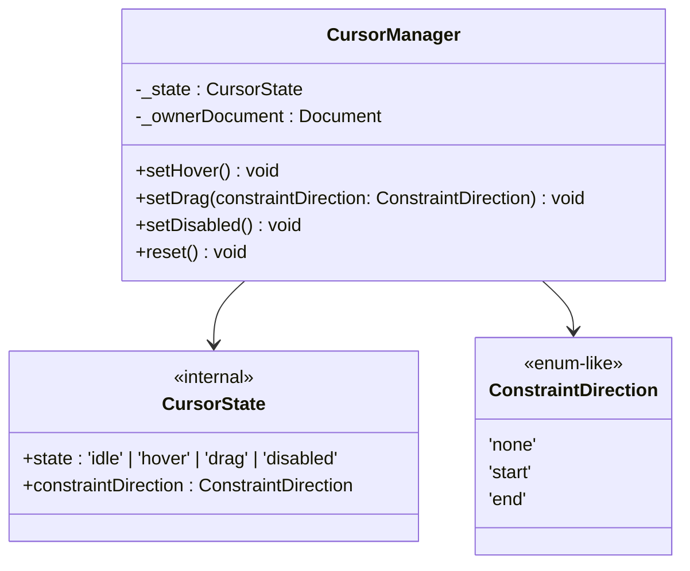

# CursorManager

拖曳期間的全域游標樣式管理模組。在 `document.body` 上設定 cursor 與 user-select。

## Class Diagram



## Constructor

```js
new CursorManager(document)
```

| Parameter | Type | Description |
|-----------|------|-------------|
| `document` | `Document` | 作用目標的 Document 物件 |

## Public API

### setHover() → void

進入 hover 狀態，設定 `col-resize` cursor。

```js
manager.setHover()
// body.style.cursor = 'col-resize'
```

### setDrag(constraintDirection) → void

進入 drag 狀態，根據約束方向設定對應 cursor，並禁止文字選取。

```js
manager.setDrag(ConstraintDirection.None)   // cursor: col-resize
manager.setDrag(ConstraintDirection.Start)  // cursor: e-resize（只能往右）
manager.setDrag(ConstraintDirection.End)    // cursor: w-resize（只能往左）
```

| ConstraintDirection | Cursor | Meaning |
|---------------------|--------|---------|
| `none` | `col-resize` | 雙向皆可拖曳 |
| `start` | `e-resize` | 左側 panel 在 minSize 或右側在 maxSize |
| `end` | `w-resize` | 左側 panel 在 maxSize 或右側在 minSize |

### setDisabled() → void

進入 disabled 狀態，設定 `not-allowed` cursor。

### reset() → void

回到 idle 狀態，移除所有 body 樣式修改。

## State Machine

```
idle → setHover() → hover
idle → setDrag()  → drag
idle → setDisabled() → disabled
any  → reset()    → idle
```
