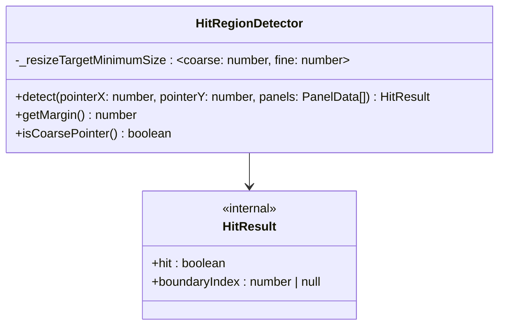

# HitRegionDetector

命中區域判定模組。判斷指標座標是否落在兩個 Panel 的邊界命中區域內，支援粗指標（觸控）與細指標（滑鼠）。

## Class Diagram



## Constructor

```js
new HitRegionDetector(resizeTargetMinimumSize)
```

| Parameter | Type | Required | Default | Description |
|-----------|------|----------|---------|-------------|
| `resizeTargetMinimumSize` | `{ coarse: number, fine: number }` | No | `{ coarse: 20, fine: 10 }` | 命中區域大小（px） |

建構時透過 `matchMedia('(pointer: coarse)')` 偵測指標類型。

## Public API

### detect(pointerX, pointerY, panels) → HitResult

判斷指標座標是否落在邊界 ± margin 範圍內。

```js
detector.detect(200, 50, panels)
// { hit: true, boundaryIndex: 0 }

detector.detect(100, 50, panels)
// { hit: false, boundaryIndex: null }
```

- 邊界 X 座標取自 `panels[0].element.getBoundingClientRect().right`
- 命中判定：`|pointerX - boundaryX| <= margin`

### getMargin() → number

回傳當前指標類型對應的 margin（px）。粗指標回傳 `coarse`，細指標回傳 `fine`。

### isCoarsePointer() → boolean

回傳是否為粗指標（觸控設備）。

## HitResult

```js
{ hit: true, boundaryIndex: 0 }   // 命中第 0 個邊界（panel[0] 與 panel[1] 之間）
{ hit: false, boundaryIndex: null } // 未命中
```
