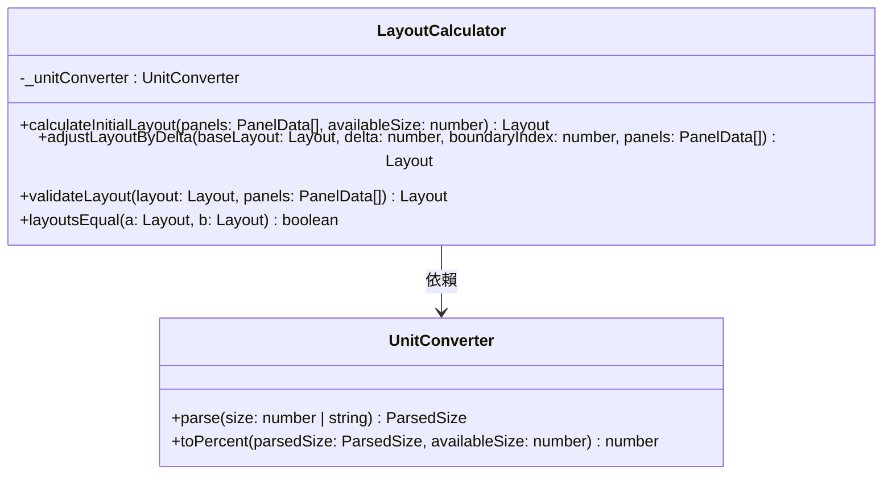

# LayoutCalculator

Layout 數學計算模組。負責初始 layout 分配、拖曳 delta 調整、約束驗證、layout 相等比較。

## Class Diagram



## Constructor

```js
new LayoutCalculator(unitConverter)
```

| Parameter | Type | Description |
|-----------|------|-------------|
| `unitConverter` | `UnitConverter` | 單位轉換器實例 |

## Public API

### calculateInitialLayout(panels, availableSize) → Layout

根據 panel 配置計算初始 layout。

**流程**：
1. 有 `defaultSize` 的 panel 按指定值分配（px 透過 UnitConverter 轉為百分比）
2. 無 `defaultSize` 的 panel 均分剩餘空間；若全無 defaultSize 則均分 100%
3. 加總 ≠ 100% 時按比例 normalize
4. 套用 min/max 約束（`_applyConstraints`）

```js
const layout = calculator.calculateInitialLayout(panels, 1000)
// { main: 70, side: 30 }
```

### adjustLayoutByDelta(baseLayout, delta, boundaryIndex, panels) → Layout

基於 baseLayout + delta 計算新 layout，只調整 boundaryIndex 相鄰的兩個 panel。

- delta 以 baseLayout 為基準（非累計式），避免浮點誤差漂移
- 兩側 panel 同時受 min/max 約束，取較小的可用 delta
- 無法套用任何 delta 時回傳 baseLayout（全有或全無）

```js
calculator.adjustLayoutByDelta({ a: 50, b: 50 }, 10, 0, panels)
// { a: 60, b: 40 }

// 碰到約束 — panelB.constraints.minSize = 30
calculator.adjustLayoutByDelta({ a: 50, b: 50 }, 30, 0, panels)
// { a: 70, b: 30 }
```

### validateLayout(layout, panels) → Layout

驗證 layout 是否符合所有 panel 約束，不符合時自動修正。

適用場景：容器 resize 後 px 約束的百分比等價值改變，既有 layout 可能違規。best-effort clamp，不 throw、不回傳 null。

```js
// panel a minSize=40, layout 中 a=30 違規
calculator.validateLayout({ a: 30, b: 70 }, panels)
// { a: 40, b: 60 }
```

### layoutsEqual(a, b) → boolean

比較兩個 layout 是否相等，使用 `toFixed(3)` 浮點容差。

```js
calculator.layoutsEqual({ a: 49.9999, b: 50.0001 }, { a: 50, b: 50 })
// true
```

## Constraint Resolution Strategy

1. 加總 ≠ 100% 時，先等比例 normalize 回 100%
2. 每個 panel 依序 clamp 到 min/max，累積 `remainingSize`
3. 從 index 0 開始，將 remainingSize 重分配給可接受的 panel
4. `minSize > maxSize` 衝突時 **maxSize 勝出**
5. 極端約束衝突時加總可能 ≠ 100%（由 CSS flex-grow 自動 normalize）

## Floating Point Tolerance

以 `toFixed(3)` 四捨五入後比較（沿用 react-resizable-panels 策略）。例如 `49.9999` 和 `50.0001` 四捨五入後都是 `50.000`，判定相等。
