# ResizablePanelManager

Orchestrator，協調 LayoutCalculator、HitRegionDetector、CursorManager、ResizeObserver，對外提供 panel 管理與事件通知 API。

## Class Diagram

```mermaid
classDiagram
    direction TB

    class ResizablePanelManager {
        -_config : GroupConfig
        -_panels : PanelData[]
        -_layout : Layout
        -_layoutCalculator : LayoutCalculator
        -_hitRegionDetector : HitRegionDetector
        -_cursorManager : CursorManager
        -_resizeObserver : ResizeObserver
        -_eventListeners : Map
        -_active : boolean
        -_dragState : DragState
        +registerPanel(config: PanelConfig) string
        +unRegisterPanel(panelId: string) void
        +on(event: string, callback: Function) void
        +off(event: string, callback: Function) void
        +activate() LayoutResult
        +deactivate() void
        +getLayout() LayoutResult
    }

    class DragState {
        <<internal>>
        +dragging : boolean
        +initialLayout : Layout | null
        +pointerDownAt : ~x: number, y: number~ | null
        +activeBoundaryIndex : number | null
    }

    class GroupConfig {
        <<input>>
        +element : HTMLElement
        +disabled : boolean
        +disableCursor : boolean
        +resizeTargetMinimumSize : ~coarse: number, fine: number~
    }

    class PanelConfig {
        <<input>>
        +id : string
        +element : HTMLElement
        +defaultSize : number | string
        +minSize : number | string
        +maxSize : number | string
        +disabled : boolean
    }

    class PanelData {
        <<internal>>
        +id : string
        +element : HTMLElement
        +config : PanelConfig
        +constraints : PanelConstraints
    }

    class PanelConstraints {
        <<internal>>
        +minSize : number
        +maxSize : number
    }

    class Layout {
        <<internal / plain object>>
        +[panelId] : number
    }

    class LayoutResult {
        <<callback payload / plain object>>
        +[panelId] : ~size: number, element: HTMLElement~
    }

    ResizablePanelManager --> GroupConfig
    ResizablePanelManager --> PanelData
    ResizablePanelManager --> Layout
    ResizablePanelManager --> LayoutResult
    ResizablePanelManager --> DragState
    PanelData --> PanelConfig
    PanelData --> PanelConstraints
    DragState --> Layout
```



## Constructor

```js
new ResizablePanelManager({ groupConfig, panelConfigs })
```

| Parameter | Type | Required | Description |
|-----------|------|----------|-------------|
| `groupConfig.element` | `HTMLElement` | Yes | Group 容器 DOM 元素 |
| `groupConfig.disabled` | `boolean` | No | 停用整組 resize，預設 `false` |
| `groupConfig.disableCursor` | `boolean` | No | 關閉游標管理，預設 `false` |
| `groupConfig.resizeTargetMinimumSize` | `{ coarse: number, fine: number }` | No | 自訂命中區域大小（px） |
| `panelConfigs` | `PanelConfig[]` | No | 初始 panel 配置，等同依序呼叫 `registerPanel` |

## Public API

### registerPanel(config) → string

註冊 panel，回傳 `panelId`。只做註冊，不觸發 layout 重算。

```js
manager.registerPanel({
  id: 'main',
  element: mainEl,
  defaultSize: '70%',
  minSize: '30%',
  maxSize: '80%',
  disabled: false
})
```

| PanelConfig Field | Type | Required | Description |
|-------------------|------|----------|-------------|
| `id` | `string` | Yes | Panel 唯一識別 |
| `element` | `HTMLElement` | Yes | Panel DOM 元素 |
| `defaultSize` | `number \| string` | No | 初始尺寸，如 `50`、`'50%'`、`'200px'` |
| `minSize` | `number \| string` | No | 最小尺寸，預設 `'0%'` |
| `maxSize` | `number \| string` | No | 最大尺寸，預設 `'100%'` |
| `disabled` | `boolean` | No | 停用該 panel 的 resize，預設 `false` |

### unRegisterPanel(panelId) → void

移除已註冊的 panel。找不到時不報錯。

### on(event, callback) → void

註冊事件監聽。支援同一事件多個 callback。

```js
manager.on(manager.Event.LayoutChange, (layoutResult) => {
  // layoutResult: { panelId: { size: number, element: HTMLElement } }
})
```

### off(event, callback) → void

取消事件監聽，需傳入原始 callback 參照。

### activate() → LayoutResult

計算初始 layout、啟動 ResizeObserver 與 pointer 事件監聽。已 active 時再呼叫會先 deactivate 再重新啟動。

### deactivate() → void

停止計算與監聽。已註冊的 panels 和事件保留，可重複呼叫 activate / deactivate 循環。

### getLayout() → LayoutResult | null

取得當前 layout。未啟動時回傳 `null`。

## Events

| Event | Payload | Timing |
|-------|---------|--------|
| `LayoutChange` | `LayoutResult` | activate、每次 layout 變化（拖曳中持續觸發、resize 後） |
| `DragEnd` | `LayoutResult` | 拖曳結束（pointerup） |

透過 `manager.Event.LayoutChange` / `manager.Event.DragEnd` 取得事件常數。

## Data Structures

### Layout (internal)

```js
{ main: 70, side: 30 }  // key: panelId, value: 百分比 (0-100)
```

### LayoutResult (callback payload)

```js
{
  main: { size: 70, element: HTMLElement },
  side: { size: 30, element: HTMLElement }
}
```

## Design Decisions

- Panel 順序基於 DOM 位置（offsetLeft 排序）
- 拖曳 delta 基於 baseLayout（非累計式），避免浮點誤差漂移
- setPointerCapture 延遲到 pointermove，避免影響 click 事件
- 約束衝突時 maxSize 永遠勝出
- iframe 指標釋放偵測：pointermove 中檢查 `event.buttons === 0`
