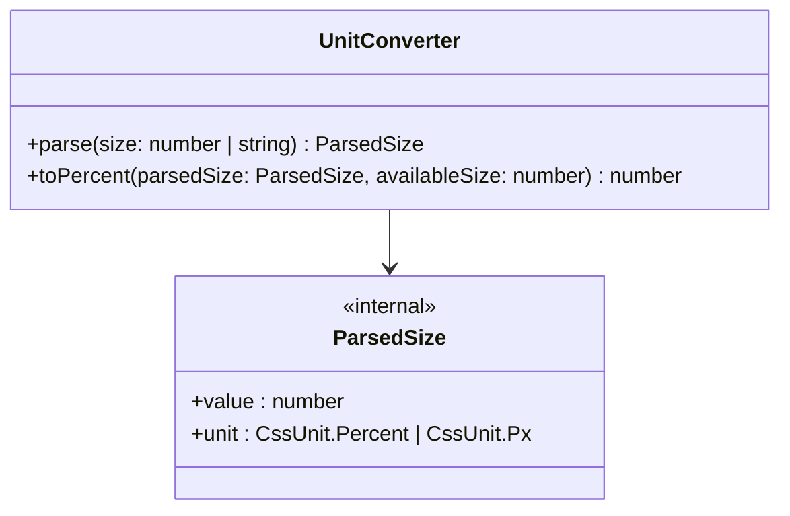

# UnitConverter

CSS 單位解析與百分比轉換模組，支援 `%` 與 `px` 單位。

## Class Diagram



## Constructor

```js
new UnitConverter()
```

無參數。

## Public API

### parse(size) → ParsedSize

將原始尺寸值解析為 `{ value, unit }` 結構。

```js
converter.parse(50)        // { value: 50, unit: '%' }
converter.parse('200px')   // { value: 200, unit: 'px' }
converter.parse('50%')     // { value: 50, unit: '%' }
converter.parse('abc')     // { value: 0, unit: '%' }
converter.parse('200em')   // throws Error
```

| Input | Behavior |
|-------|----------|
| 數字 | 視為百分比 |
| 字串無單位 / 純數字字串 | 視為百分比 |
| `parseFloat` 得到 NaN | value 轉為 0 |
| 不支援的單位（如 `em`、`rem`） | throw Error |

### toPercent(parsedSize, availableSize) → number

將 ParsedSize 轉換為百分比。

```js
converter.toPercent({ value: 50, unit: '%' }, 1000)    // 50
converter.toPercent({ value: 200, unit: 'px' }, 1000)  // 20
converter.toPercent({ value: 200, unit: 'px' }, 0)     // 0
```

- `%` 單位直接回傳 value
- `px` 單位以 `(value / availableSize) * 100` 換算
- `availableSize` 為 0 時回傳 0（避免除零）
- 不做 clamp（SRP，clamp 是 LayoutCalculator 職責）

## Supported Units

| Unit | Example |
|------|---------|
| `%` | `'50%'` |
| `px` | `'200px'` |
